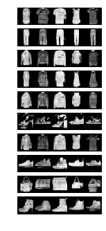

Conditional Generative Adversarial Networks
================================================
In the previous chapter, images were randomly generated without respect to classes. Here we shall generated Images of specific classes
While Conditional GANs are complex, torchfusion makes this super easy, all you have to do is state the num_classes in the 
Generator, Discriminator and in the Learner

**Use classes in Generator and Discriminator** ::

    G = StandardGenerator(output_size=(1,32,32),latent_size=128,num_classes=10)
    D = StandardProjectionDiscriminator(input_size=(1,32,32),apply_sigmoid=False,num_classes=10)

**Define num_classes in Learner** ::

    if __name__ == "__main__":
        learner.train(dataset,num_classes=10,gen_optimizer=g_optim,disc_optimizer=d_optim,save_outputs_interval=500,model_dir="./fashion-gan",latent_size=128,num_epochs=50,batch_log=False)

And thats it ! The full code is below

**Putting it all Together** ::

    from torchfusion.gan.learners import *
    from torchfusion.gan.applications import StandardGenerator,StandardProjectionDiscriminator
    from torch.optim import Adam
    from torchfusion.datasets import fashionmnist_loader
    import torch.cuda as cuda
    import torch.nn as nn

    G = StandardGenerator(output_size=(1,32,32),latent_size=128,num_classes=10)
    D = StandardProjectionDiscriminator(input_size=(1,32,32),apply_sigmoid=False,num_classes=10)

    if cuda.is_available():
        G = nn.DataParallel(G.cuda())
        D = nn.DataParallel(D.cuda())

    g_optim = Adam(G.parameters(),lr=0.0002,betas=(0.5,0.999))
    d_optim = Adam(D.parameters(),lr=0.0002,betas=(0.5,0.999))

    dataset = fashionmnist_loader(size=32,batch_size=64)

    learner = RStandardGanLearner(G,D)

    if __name__ == "__main__":
        learner.train(dataset,num_classes=10,gen_optimizer=g_optim,disc_optimizer=d_optim,save_outputs_interval=500,model_dir="./fashion-gan",latent_size=128,num_epochs=50,batch_log=False)

After just 17 epochs, this produces

.. toctree::
   :maxdepth: 1
   :caption: Contents:

