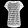

Hello FASHION MNIST!
====================
TorchFusion makes data loading, network definition and training very easy. As you will see 
in this tutorial. We shall be training a basic pytorch model on the Fashion MNIST dataset.

**FASHION MNIST DESCRIPTION**

MNIST has been over-explored, state-of-the-art on MNIST doesn't make much sense with over
99% already achieved. Fashion MNIST provides a more challenging version of the MNIST dataset.
It contains 10 classes of grayscale diagrams of fashion items. It is exactly the same size, dimension 
and format as MNIST, but it is more challenging, hence, it is provides a dataset that is both
fast to train and yet challenging enough to benchmark new models.
Below are samples from the FashionMNIST dataset.

To learn more visit. `Fashion MNIST <https://github.com/zalandoresearch/fashion-mnist/>`_

**Import Classes** ::

    from torchfusion.layers import *
    from torchfusion.datasets import *
    from torchfusion.metrics import *
    import torch.nn as nn
    import torch.cuda as cuda
    from torch.optim import Adam
    from torchfusion.learners import StandardLearner

**Load the dataset** ::

    train_loader = fashionmnist_loader(size=28,batch_size=32)
    test_loader = fashionmnist_loader(size=28,train=False,batch_size=32)

If you have used PyTorch before, you will notice just how simpler the data loading process is,
this function still allows you to specify custom transformations. By default, TorchFusion loaders
will normalize the images to range between -1 to 1, you can control the default normalization using
the mean and std args.

**Define the model** ::

    model = nn.Sequential(
        Flatten(),
        Linear(784,100),
        Swish(),
        Linear(100,100),
        Swish(),
        Linear(100,100),
        Swish(),
        Linear(100,10)
    )

The above is a simple 4 layer MLP, notice that all the layers above are from torchfusion.
Unlike pure pytorch layers, torchfusion layers have optimal initialization by default, and you can easily specify custom
initialization for them. However, they are still 100% compatible with their equivalent pytorch layers. You can also mix pure pytorch and torchfusion layers in the same model.

**Define optimizer and loss** ::

    if cuda.is_available():
        model = model.cuda()
    
    optimizer = Adam(model.parameters())

    loss_fn = nn.CrossEntropyLoss()

    train_metrics = [Accuracy()]
    test_metrics = [Accuracy()]

**Print Summary and Train the model** ::

    learner = StandardLearner(model)

    if __name__ == "__main__":
        learner.summary((1,28,28))
        learner.train(train_loader,train_metrics=train_metrics,optimizer=optimizer,loss_fn=loss_fn,test_loader=test_loader,test_metrics=test_metrics,num_epochs=40,batch_log=False)    

**PUTTING IT ALL TOGETHER** ::

    
    from torchfusion.layers import *
    from torchfusion.datasets import *
    from torchfusion.metrics import *
    import torch.nn as nn
    import torch.cuda as cuda
    from torch.optim import Adam
    from torchfusion.learners import StandardLearner

    train_loader = fashionmnist_loader(size=28,batch_size=32)
    test_loader = fashionmnist_loader(size=28,train=False,batch_size=32)

    model = nn.Sequential(
        Flatten(),
        Linear(784,100),
        Swish(),
        Linear(100,100),
        Swish(),
        Linear(100,100),
        Swish(),
        Linear(100,10)
    )

    if cuda.is_available():
        model = model.cuda()
    
    optimizer = Adam(model.parameters())

    loss_fn = nn.CrossEntropyLoss()

    train_metrics = [Accuracy()]
    test_metrics = [Accuracy()]

    learner = StandardLearner(model)

    if __name__ == "__main__":
        
        print(learner.summary((1,28,28)))
        learner.train(train_loader,train_metrics=train_metrics,optimizer=optimizer,loss_fn=loss_fn,test_loader=test_loader,test_metrics=test_metrics,num_epochs=40,batch_log=False)

Running the code above should reach an accuracy of about 90% after 30 epochs.

You can enable and disable epoch-end visualizations with the boolean args: **display_metrics** and **save_metrics**

**PERFORMANCE METRICS**

The Accuracy class measures the the topK accuracy. The default is top1, however, you can easily specify any K level.

**Top K metric example**::

    train_metrics = [Accuracy(),Accuracy(topK=2),Accuracy(topK=5)]

**Load the saved weights and evaluate performance on test set**

We have just trained a classifier on Fashion MNIST and evaluated the performance 
at the end of each epoch. You can also use the evaluation function to evaluate the 
test performance separately.
    
**Run evaluation** ::

    if __name__ == "__main__":
        top1_acc = Accuracy()
        top5_acc = Accuracy(topK=5)
        
        learner.load_model("best-models/model_3.pth")
        learner.evaluate(test_loader,[top1_acc,top5_acc])
        print("Top1 Acc: {} Top5 Acc: {}".format(top1_acc.getValue(),top5_acc.getValue()))

This produces
Top1 Acc: 0.871399998664856 Top5 Acc: 0.996999979019165

**Inference**

The ultimate goal of training models is to use them to classify new images,
now that we have trained the model on fashion images, save the images below and
use the code after to classify them

    

**Inference code** ::

    import torch
    from torchfusion.layers import *
    import torch.nn as nn
    import torch.cuda as cuda
    from torchfusion.learners import StandardLearner
    from torchfusion.utils import load_image

    model = nn.Sequential(
        Flatten(),
        Linear(784,100),
        Swish(),
        Linear(100,100),
        Swish(),
        Linear(100,100),
        Swish(),
        Linear(100,10)
    )

    if cuda.is_available():
        model = model.cuda()

    learner = StandardLearner(model)
    learner.load_model("best_models\model_20.pth")

    if __name__ == "__main__":

        #map class indexes to class names
        class_map = {0:"T-Shirt",1:"Trouser",2:"Pullover",3:"Dress",4:"Coat",5:"Sandal",6:"Shirt",7:"Sneaker",8:"Bag",9:"Ankle Boot"}
    
        #Load the image
        image = load_image("sample-1.jpg",grayscale=True,target_size=28,mean=0.5,std=0.5)
        
        #add batch dimension
        image = image.unsqueeze(0)
        
        #run prediction
        pred = learner.predict(image)
    
        #convert prediction to probabilities
        pred = torch.softmax(pred,0)
    
        #get the predicted class
        pred_class = pred.argmax().item()
    
        #get confidence for the prediction
        pred_conf = pred.max().item()
    
        #Map class_index to name
        class_name = class_map[pred_class]
        print("Predicted Class: {}, Confidence: {}".format(class_name,pred_conf))
        
    

