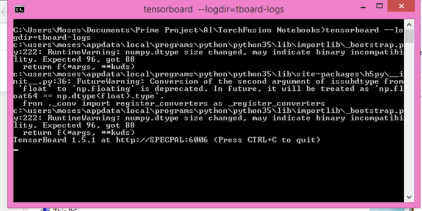

Logging and Visualizing the Training Process!
===============================================
While torchfusion allows you to easily visualize the training process using matplotlib based charts, for more advanced visualization,
Torchfusion has in-built support for visualizing the training process in both Visdom and Tensorboard.

**Logging with Visdom**

`Visdom <https://github.com/facebookresearch/visdom/>`_ is a visualizing kit developed by Facebook AI Research, visdom was installed the first time you installed Torchfusion.

To visualize your training process in visdom, follow the steps below.

**Step 1: Import the visdom logger**::

    from torchfusion.utils import VisdomLogger

**Step 2: Specify the logger in your train func** ::

    visdom_logger = VisdomLogger()
    if __name__ == "__main__":
        learner.train(train_loader,train_metrics=train_metrics,optimizer=optimizer,loss_fn=loss_fn,visdom_log=visdom_logger)    

**Step 3: Start the visdom server from the commad promp** ::

    python -m visdom.server

Ensure you are connected to the intenet when you run this, as visdom will need to download a few scripts.

Notice the output above, open your browser and navigate to the url given, in this case: localhost:8097

**Run this to see visdom in action** ::
    
    from torchfusion.layers import *
    from torchfusion.datasets import *
    from torchfusion.metrics import *
    import torch.nn as nn
    import torch.cuda as cuda
    from torch.optim import Adam
    from torchfusion.learners import StandardLearner
    from torchfusion.utils import VisdomLogger

    train_loader = fashionmnist_loader(size=28,batch_size=32)
    test_loader = fashionmnist_loader(size=28,train=False,batch_size=32)

    model = nn.Sequential(
        Flatten(),
        Linear(784,100),
        Swish(),
        Linear(100,100),
        Swish(),
        Linear(100,100),
        Swish(),
        Linear(100,10)
    )

    if cuda.is_available():
        model = model.cuda()
    
    optimizer = Adam(model.parameters())

    loss_fn = nn.CrossEntropyLoss()

    train_metrics = [Accuracy()]
    test_metrics = [Accuracy()]

    visdom_logger = VisdomLogger()

    learner = StandardLearner(model)

    if __name__ == "__main__":
        
        print(learner.summary((1,28,28)))
        learner.train(train_loader,train_metrics=train_metrics,visdom_log=visdom_logger,optimizer=optimizer,loss_fn=loss_fn,test_loader=test_loader,test_metrics=test_metrics,num_epochs=30,batch_log=False)

**Generated Visuals** 

**Using Tensorboard**
Torchfusion can also generate tensorboard logs that you can view with tensorboard, while Torchfusion does not require
tensorboard or tensorflow installed to generate the logs as it uses `TensorboardX <https://github.com/lanpa/tensorboardX/>`_, you need to install both tensorflow and tensorboard
to view the generated logs.

Vist `tensorflow.org <https://tensorflow.org/>`_ for instructions on installing tensorflow
and `https://github.com/tensorflow/tensorboard <https://github.com/tensorflow/tensorboard/>`_ for instructions on installing tensorbord

Once installed, you can use tensorboard in just ONE Line.

**Specify the tensorboard_log in your train func** ::

    visdom_logger = VisdomLogger()
    if __name__ == "__main__":
        learner.train(train_loader,train_metrics=train_metrics,optimizer=optimizer,loss_fn=loss_fn,tensorboard_log="./tboard-logs",visdom_log=visdom_logger)    

Notice how we use both tensorboard and visdom here, we can use either independently or both if we want to.

**Start the tensorboard server from the command prompt** ::
    tensorboard --logdir=tboard-logs

Notice the output above, open your browser and navigate to the url given, in this case: specpal:6006
 
**Run this to see tensorboard in action** ::
    
    from torchfusion.layers import *
    from torchfusion.datasets import *
    from torchfusion.metrics import *
    import torch.nn as nn
    import torch.cuda as cuda
    from torch.optim import Adam
    from torchfusion.learners import StandardLearner
    from torchfusion.utils import VisdomLogger

    train_loader = fashionmnist_loader(size=28,batch_size=32)
    test_loader = fashionmnist_loader(size=28,train=False,batch_size=32)

    model = nn.Sequential(
        Flatten(),
        Linear(784,100),
        Swish(),
        Linear(100,100),
        Swish(),
        Linear(100,100),
        Swish(),
        Linear(100,10)
    )

    if cuda.is_available():
        model = model.cuda()
    
    optimizer = Adam(model.parameters())

    loss_fn = nn.CrossEntropyLoss()

    train_metrics = [Accuracy()]
    test_metrics = [Accuracy()]

    visdom_logger = VisdomLogger()

    learner = StandardLearner(model)

    if __name__ == "__main__":
        
        print(learner.summary((1,28,28)))
        learner.train(train_loader,train_metrics=train_metrics,tensorboard_log="./tboard-logs",visdom_log=visdom_logger,optimizer=optimizer,loss_fn=loss_fn,test_loader=test_loader,test_metrics=test_metrics,num_epochs=30,batch_log=False)

**Generated Visuals** 

.. toctree::
   :maxdepth: 2
   :caption: Contents:

